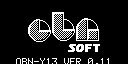
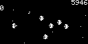

# ArduBullets

一款弹幕射击游戏，玩家在星空中移动并躲避逐渐增多的弹幕。源码来自固定 revision 的 ArduboyWorks 集合，上游子模块保持未修改。

## 截图验收

| 启动 Logo | 标题或菜单 | 核心玩法 |
| --- | --- | --- |
|  |  |  |

## 状态与运行

清单状态为 `smoke`：Linux SDL2 构建和 180 帧无头冒烟已通过，现有截图记录了标题、菜单与玩法画面。截图生成时使用的输入尚未固化为自动回放测试，因此不能据此标记为 `replay-tested` 或完成移植；其余待验收项应按本游戏实际功能逐项确认。

构建并运行 Linux SDL2 版本：

```bash
make PLATFORM=linux GAME=ardubullets
```

仅构建或执行定向测试：

```bash
make PLATFORM=linux GAME=ardubullets build
make PLATFORM=linux GAME=ardubullets test-ardubullets
```
