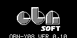
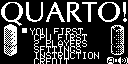
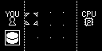

# Quarto

Arduboy 版 Quarto 双人抽象棋类游戏，也支持 CPU 对局。源码来自固定 revision 的 ArduboyWorks 集合，上游子模块保持未修改。

## 截图验收

| 启动 Logo | 标题或菜单 | 核心玩法 |
| --- | --- | --- |
|  |  |  |

## 状态与运行

当前状态为 `partial`：Linux SDL2 冷构建、180 帧冒烟和上述固定输入路径已验证；截图证明游戏已进入核心玩法，但完整流程、所有关卡、音效和长期存档仍未逐项验收。

运行：

```bash
make quarto
```
