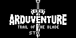

# Arduventure

Arduventure 是 TEAM a.r.g. 制作的 Arduboy 动作 RPG。玩家探索多个区域、与敌人战斗、收集和装备物品，并由四声道 ATMlib 合成器播放标题、地图和战斗音乐。



当前移植状态为 `partial`：SDL2 冷构建、180 帧无头启动、四声道标题音乐和“标题→主菜单→新游戏→剧情入口”固定输入回放已经通过。截图来自该回放的 ArduGirl framebuffer；战斗、存档、完整剧情和长时间音乐尚未验收，因此不能标记为完成。

运行：

```bash
make arduventure
```

代码采用 MIT 许可证；上游明确声明故事、角色、精灵、图块、设计和美术不属于 MIT 授权范围，相关权利归 TEAM a.r.g. 所有。
