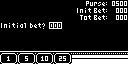
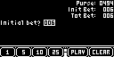

# Blackjack

Blackjack 是一款二十一点卡牌游戏，包含下注、发牌、分牌、保险和筹码结算流程。

## 移植状态

- 上游固定为 `72a6b1b7c583971568d92eca39c81b8cb99def29`，源码保持未修改。
- 最小补丁用公共音频 API 替代 AVR Timer3/Timer4 启动音效；公共层补齐 Print 与 FixedPoints。
- SDL2 冷构建、300 帧冒烟和固定输入下注路径通过；完整牌局与长期存档仍待验收，状态为 partial。

## SDL2 运行截图


Press Play on Tape 启动画面。



初始下注与筹码选择界面。



下注数值变化后出现 PLAY 与 CLEAR 操作的游戏界面。

## 构建与运行

```bash
make PLATFORM=linux GAME=blackjack
```
