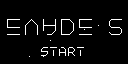
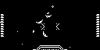

# Evade 2

Evade 2 是一款矢量风格太空躲避与射击游戏，包含启动动画、演示模式、敌机与波次战斗。

## 移植状态

- 上游固定为 `bc6fa60203afc35266b5d4c5c5140ce6a714334d`，通过四个外部补丁处理随机种子、AVR 汇编图形路径、共享 framebuffer 和音频边界。
- SDL2 冷构建、300 帧冒烟与固定输入运行通过，图形使用上游可移植 C++ 路径。
- 上游 ATMLib2 直接依赖 AVR 合成器，当前非 AVR 构建使用静音路径，因此状态仍为 partial。

## SDL2 运行截图


Modus Create 启动画面。



旋转文字标题与开始提示。



玩家飞船、星空、弹体与两侧 HUD 的核心战斗场景。

## 构建与运行

```bash
make PLATFORM=linux GAME=evade-2
```
