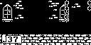
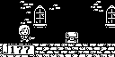

# Helmets & Hordes

横向地牢动作游戏，复用公共 ATMlib 四声道播放器。

状态：`partial`。现有截图记录了启动、菜单和玩法画面，但截图输入尚未固化为自动回放。当前源码准备存在补丁上下文不匹配，修复前不能把既有结果表述为当前通过；完整关卡与长期音乐也仍待验收。

构建并运行：`make PLATFORM=linux GAME=helmets-hordes`

仅构建：`make PLATFORM=linux GAME=helmets-hordes build`

定向测试：`make PLATFORM=linux GAME=helmets-hordes test-helmets-hordes`

## ArduGirl SDL2 实际运行截图

启动阶段：

菜单阶段：

固定输入玩法画面：
