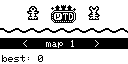
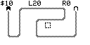
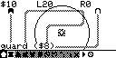
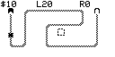

# MicroTD

MicroTD 是一款为 Arduboy 制作的微型塔防游戏。玩家选择地图、布置防御塔，并抵挡一波波来袭的敌人；它用 128x64 单色画面呈现地图、单位和状态信息。

## 游戏截图

| 地图选择 | 关卡地图 |
|---|---|
|  |  |
| 建塔菜单 | 敌人波次 |
|  |  |

## 移植状态

- 上游：https://gitlab.com/drummyfish/Arduboy_TD
- 固定 revision：`0c8958fdcf57060c1380b3ca72082ca45b7a2bb5`
- 上游修改：无
- 当前状态：固定输入回放已验证进入地图、建塔和启动波次；EEPROM 已按游戏持久化，声音仍静音
- 上游补丁：成功建塔路径缺失 `return true`，且预期的状态分支贯穿未显式标记；构建时通过独立最小补丁生成副本，子模块源码保持不变

## 运行

```bash
make microtd
```
