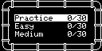
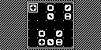

# Pipes

Pipes（上游工程名 LayingPipe）是一款多尺寸连线谜题。玩家从节点铺设管线，完成不同难度的棋盘并保存进度。

## 移植状态

- 上游固定为 `d3c0279079ef0a5c7161cbf39d2375e4d5a7aa25`，源码保持未修改。
- 补丁显式声明并包含 Arduino IDE 自动拼接的 sketch 标签页，让启动等待适配事件驱动前端，并修复奇数棋盘填充半字节导致的越界写入。
- SDL2 冷构建、300 帧冒烟和固定输入进入棋盘通过；关卡完成与 EEPROM 解锁流程仍待验收，状态为 partial。

## SDL2 运行截图



Practice、Easy 与 Medium 分组及完成进度。



进入 Practice 棋盘后的节点与管线布局。


固定方向输入后光标移动到另一节点的玩法状态。

## 构建与运行

```bash
make PLATFORM=linux GAME=pipes
```
