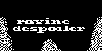
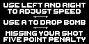
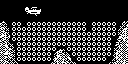

# Ravine Despoiler

Ravine Despoiler 是一款街机投弹游戏。玩家调整飞机速度，在掠过峡谷时投下炸弹，逐层清除堵塞峡谷的巨石。

## 移植状态

- 上游固定为 `c48915c69c92c1f2e070775558866d84cd70b91b`，源码保持未修改。
- SDL2 冷构建、300 帧冒烟和固定输入路径通过；标题、操作说明与实际投弹场景已验收。
- 使用公共 FixedPoints、ArduboyTones、`getPixel()` 和随机种子兼容 API。

## SDL2 运行截图



标题与峡谷画面。



进入游戏前的速度、投弹与失误惩罚说明。



飞机飞越巨石阵列的核心投弹场景。

## 构建与运行

```bash
make PLATFORM=linux GAME=ravine-despoiler
```
