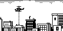
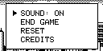

# Rooftop Rescue

Rooftop Rescue 是一款直升机救援动作游戏。玩家驾驶直升机在楼群上方移动，放下绳索营救被困人员，同时避开建筑、火灾和其他威胁。

## 移植状态

- 上游固定为 `cb8e9203f62f5ce49423742aa3fb7bc6e1ca3847`，子模块源码保持未修改。
- 静态扫描未发现 AVR 寄存器、ISR、内联汇编或动态分配。
- SDL2 冷构建、240 帧冒烟和固定输入回放通过；回放验证标题、进入玩法、直升机到站、向左换楼和放绳。
- PY32F002A 冷构建通过：`text=29164`、`data=112`、`bss=3416` 字节；尚未进行本游戏的实机画面、按钮和声音验收。

## SDL2 运行截图


标题动画结束后的 Rooftop Rescue 标志和楼群，由 ArduGirl SDL2 前端实际运行生成。



进入核心玩法后，直升机停在楼顶上方并放下救援绳索。



玩法中按 B 打开的声音、结束游戏、重置和制作人员菜单。

## 构建与运行

```bash
make PLATFORM=linux GAME=rooftop-rescue
make PLATFORM=py32 GAME=rooftop-rescue
```
