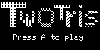
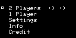
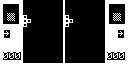

# Twotris

Twotris 是一款双人同屏下落方块游戏，也提供单人模式。两侧狭长棋盘让玩家同时整理方块与干扰对手，可用于验证组合按键、持续输入和双玩家状态更新。

## 移植状态

- 上游固定为 `73391606ba4b8e4e18e9838eb130aff410310599`，子模块源码保持未修改。
- 静态扫描未发现 AVR 寄存器、ISR 或内联汇编依赖。
- SDL2 冷构建与固定输入运行通过；回放在第 60 帧按 A 进入菜单、第 100 帧按 A 开始双人玩法。
- PY32F002A 冷构建通过：`text=14468`、`data=68`、`bss=2772` 字节。

## SDL2 运行截图



标题动画完成后的开始提示，由 ArduGirl SDL2 前端实际运行生成。



按 A 后显示双人、单人、设置、说明和制作人员菜单。



再次按 A 后进入核心玩法，两侧棋盘、当前方块和双方分数均已显示。

## 构建与运行

```bash
make PLATFORM=linux GAME=twotris
make PLATFORM=py32 GAME=twotris
```
