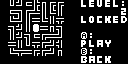

# Waternet

Waternet 是一款管线连通谜题。玩家选择难度和关卡，旋转或连接管件来恢复完整水网，并可保存解锁进度。

## 移植状态

- 上游固定为 `2f5e8ce47f9bb292a8c30fdf04f91988f0c2a300`，仅用补丁修正主入口的路径分隔符。
- SDL2 冷构建、300 帧冒烟以及标题、难度、关卡选择固定输入路径通过。
- EEPROM 固定宽度存档与关卡内完整解谜流程仍待进一步验收，状态为 partial。

## SDL2 运行截图


主菜单与 Waternet 标志。


五档难度选择界面。



迷宫预览、锁定状态及进入关卡提示。

## 构建与运行

```bash
make PLATFORM=linux GAME=waternet
```
